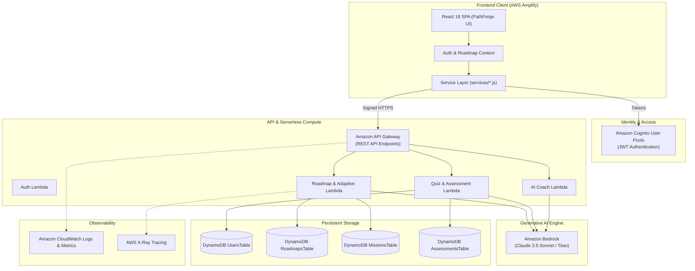

# PathForge AI

> **Forge your path. Master your future.**
>
> An AI-powered adaptive career learning platform that helps students and early-career learners understand what skills they need for target technology careers, generates personalized learning roadmaps, delivers weekly learning missions and assessments, and dynamically adapts the curriculum based on demonstrated skill mastery.

---

## 🚀 Hackathon Quick Start (Local MVP)

This MVP was built for an **AWS Hackathon**. It runs entirely locally with zero external API dependencies or costs, while implementing a clean service-oriented architecture designed for direct migration to Amazon Web Services.

### Prerequisites
- Node.js `v18+` or `v20+` or `v24+`
- npm `v9+` or `v10+` or `v11+`

### Installation & Launch
```bash
# Navigate to the project directory
cd pathforge-ai

# Install dependencies
npm install

# Start the Vite local development server
npm run dev
```

Visit `http://localhost:5173` in your browser.

---

## 🌟 Instant Evaluation: Demo Mode

Judges and evaluators can immediately explore a rich, pre-populated learner profile without going through manual setup:

1. On the Landing Page or Login screen (`/login`), click **"Explore Demo"**.
2. This instantly initializes **Alex Rivera**:
   - **Target Career**: MLOps Engineer
   - **Overall Progress**: 38%
   - **Active Mission**: Week 3: *Docker Fundamentals* (65% task progress, 2h 30m remaining)
   - **Completed Missions**: Week 1: *Python for Production* (90% score), Week 2: *Git & Linux Workflow* (85% score)
   - **Assessment History**: 2 scored evaluations with strength/weakness diagnostics
   - **Skill Matrix**: Python (85%), Git (70%), Linux (62%), Docker (48%), Kubernetes (18% - Gap)
3. You can also register a new account anytime at `/register` to test the full 5-step onboarding and AI generation workflow from scratch.

---

## 🎯 The Problem

Early-career tech learners and university students face three critical hurdles:
1. **Curriculum Blindness**: Job descriptions list dozens of disjointed keywords without explaining prerequisites, real-world context, or the sequential progression required to land the role.
2. **Static, Rigid Roadmaps**: Existing roadmaps (e.g. static web checklists or generic bootcamps) treat every learner identically. If a student struggles with containerization, the curriculum pushes them directly into Kubernetes anyway, causing frustration and dropouts.
3. **Disconnected Chatbots**: Generic conversational AI tools suffer from "prompt fatigue"—they lack persistent memory of the user's ongoing progress, completed projects, and verified assessment scores.

---

## 💡 The PathForge Solution & Adaptive Philosophy

PathForge AI is **not** a generic "enter a prompt and receive text" chatbot. Instead, AI operates behind key educational product workflows:

```
Baseline Skill Gap Analysis
        ↓
Personalized Roadmap Generation (6-12 Weeks)
        ↓
Weekly Hands-on Missions & Code Challenges
        ↓
5-Question Conceptual Assessments
        ↓
Demonstrated Skill Evaluation
        ↓
[Adaptive Curriculum Engine]
   ├─ Score ≥ 80%  → Strong Mastery: Accelerate to next milestone
   ├─ Score 60-79% → Progress with Recommended Review
   └─ Score < 60%  → Insert Dynamic Remediation Challenge Before Advancing!
```

> **Core Differentiating Principle**: The roadmap evolves based on what the learner **demonstrates they know**, not merely what they initially say they know.

---

## 🧩 Key Features

- **AI Skill-Gap Analysis**: Benchmarks user baseline across 5 tech tracks (*MLOps Engineer, AI/ML Engineer, Cloud Engineer, Data Scientist, DevOps Engineer*).
- **Dynamic Multi-Week Roadmaps**: Interactive timeline displaying statuses (`Completed`, `Current`, `Locked`, `Adapted by AI`).
- **Weekly Learning Missions**: Practical task checklists with local persistence, curated technical references, and portfolio challenges.
- **Mastery Assessments**: 5-question multiple choice quizzes dynamically generated with explanations, scoring, strengths, and weaknesses.
- **Adaptive Curriculum Engine**: If a learner scores `<60%` on a weekly assessment (e.g. Docker), PathForge automatically inserts a targeted *Reinforcement & Remediation Challenge* into the roadmap and shifts dependent milestones.
- **Judge Demo Simulation Tools**: When taking any assessment, one-click helper buttons allow judges to test both a `<60%` score (triggering the adaptive modal and curriculum insertion) and a `100%` score.
- **Readiness Analytics**: Interactive radar and bar charts powered by Recharts visualizing progress toward industry benchmarks.
- **Context-Aware AI Coach**: Career coach providing guidance informed by the learner's active mission, streak, and skill gap profile.

---

## 🛠 Technology Stack

| Layer | Local MVP Implementation | Production AWS Target |
|---|---|---|
| **Frontend Framework** | React 18 + Vite | AWS Amplify Hosting |
| **Routing** | React Router v6 | Amazon CloudFront + S3 / Amplify |
| **Icons & Design** | Lucide React + Modern Dark CSS | Tailwind / CSS Design System |
| **Data Visualizations** | Recharts (Radar, Bar charts) | Recharts + CloudWatch Embedded |
| **Persistence** | Centralized LocalStorage Service | Amazon DynamoDB |
| **Authentication** | Local Auth Service Simulation | Amazon Cognito User Pools |
| **AI Generation** | High-Fidelity Mock AI Service (with simulated latency) | Amazon Bedrock (Claude 3.5 Sonnet / Titan) |
| **API & Compute** | Service Layer Abstraction | Amazon API Gateway + AWS Lambda |
| **Monitoring** | Browser Console Telemetry | Amazon CloudWatch Logs & Metrics |

---

## 🏗 AWS Migration Architecture

PathForge AI has been strictly engineered to separate the UI layer from service logic. No mock data is hardcoded inside components. The application communicates exclusively via:

- `src/services/authService.js` → Target: **Amazon Cognito**
- `src/services/aiService.js` → Target: **Amazon API Gateway + AWS Lambda + Amazon Bedrock**
- `src/services/storageService.js` → Target: **Amazon DynamoDB**
- `src/services/roadmapService.js` → Target: **AWS Lambda (Business Logic)**
- `src/services/quizService.js` → Target: **AWS Lambda + Amazon Bedrock**

### Architecture Diagram



---

## 📁 Project Directory Structure

```
pathforge-ai/
├── src/
│   ├── components/
│   │   ├── common/             # Reusable UI primitives
│   │   │   ├── Button.jsx
│   │   │   ├── Card.jsx
│   │   │   ├── ProgressBar.jsx
│   │   │   ├── Badge.jsx
│   │   │   ├── Modal.jsx
│   │   │   └── LoadingState.jsx
│   │   ├── layout/             # Application shell
│   │   │   ├── Navbar.jsx
│   │   │   ├── Sidebar.jsx
│   │   │   ├── DashboardLayout.jsx
│   │   │   └── Footer.jsx
│   │   ├── dashboard/          # Dashboard widgets
│   │   │   ├── StatCard.jsx
│   │   │   ├── CurrentMission.jsx
│   │   │   ├── SkillProgress.jsx
│   │   │   └── ActivityFeed.jsx
│   │   ├── roadmap/            # Visual timeline
│   │   │   ├── RoadmapTimeline.jsx
│   │   │   └── RoadmapItem.jsx
│   │   ├── missions/           # Missions & task checklist
│   │   │   ├── MissionCard.jsx
│   │   │   └── TaskList.jsx
│   │   ├── assessments/        # Quizzes & feedback
│   │   │   ├── QuizQuestion.jsx
│   │   │   └── QuizResults.jsx
│   │   └── skills/             # Competency matrix
│   │       ├── SkillCard.jsx
│   │       └── SkillChart.jsx
│   ├── context/                # Global React State
│   │   ├── AuthContext.jsx
│   │   └── RoadmapContext.jsx
│   ├── data/                   # Seed & Career Data
│   │   ├── careers.js
│   │   └── demoData.js
│   ├── pages/                  # Route Pages
│   │   ├── LandingPage.jsx     # Route: /
│   │   ├── LoginPage.jsx       # Route: /login
│   │   ├── RegisterPage.jsx    # Route: /register
│   │   ├── OnboardingPage.jsx  # Route: /onboarding
│   │   ├── DashboardPage.jsx   # Route: /dashboard
│   │   ├── RoadmapPage.jsx     # Route: /roadmap
│   │   ├── MissionsPage.jsx    # Route: /missions
│   │   ├── MissionDetailsPage.jsx # Route: /missions/:id
│   │   ├── AssessmentsPage.jsx # Route: /assessments
│   │   ├── QuizPage.jsx        # Route: /assessments/:id
│   │   ├── SkillsPage.jsx      # Route: /skills
│   │   ├── CoachPage.jsx       # Route: /coach
│   │   └── ProfilePage.jsx     # Route: /profile
│   ├── services/               # Mock/Local Services (AWS Migration Points)
│   │   ├── aiService.js        # -> Amazon Bedrock
│   │   ├── authService.js      # -> Amazon Cognito
│   │   ├── storageService.js   # -> Amazon DynamoDB
│   │   ├── roadmapService.js   # -> AWS Lambda
│   │   ├── quizService.js      # -> AWS Lambda
│   │   └── userService.js      # -> AWS Lambda
│   ├── styles/
│   │   └── index.css           # Premium SaaS dark theme
│   ├── App.jsx                 # Routing configuration
│   └── main.jsx
├── package.json
├── vite.config.js
└── README.md
```

---

## ⚡ Adaptive Learning Engine Walkthrough (How to Test)

1. Open `/dashboard` (via **Explore Demo** or by onboarding).
2. Click on the current mission (**Docker Fundamentals**, Week 3).
3. Check off tasks or click **"Mark Challenge Complete"**.
4. Click **"Take Mission Assessment"**.
5. To test the adaptive engine:
   - Click the top demo button **"Test Adaptive Trigger (<60%)"** to auto-populate answers yielding a 20% score.
   - Click **Submit Assessment**.
   - Review your diagnostics showing weak areas in container networking and security.
   - Click **"View Adaptive Roadmap"**.
   - The **"Your Roadmap Has Been Adapted"** modal appears explaining that PathForge detected conceptual gaps and inserted a **Docker Reinforcement & Remediation Challenge** before advancing to Kubernetes!
   - View the updated timeline on `/roadmap` showing the newly inserted milestone tagged `Adapted by AI`.

---

## 🔒 Security & Privacy

- No AWS credentials or secrets are committed or simulated in frontend code.
- Clean abstraction ensures all client calls route through authenticated service methods ready for Cognito JWT headers.
- Input validation and state sanitization are applied across all forms.

---

## 📜 License

Created for the AWS Hackathon. All rights reserved.
